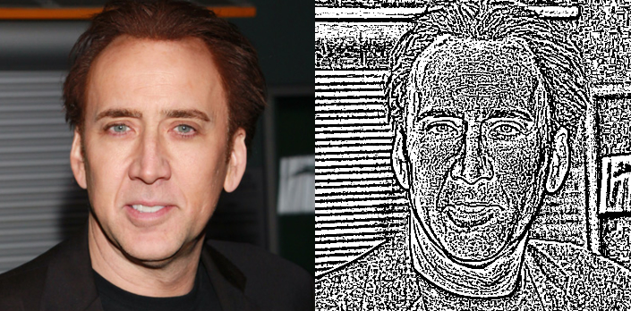
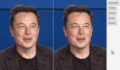
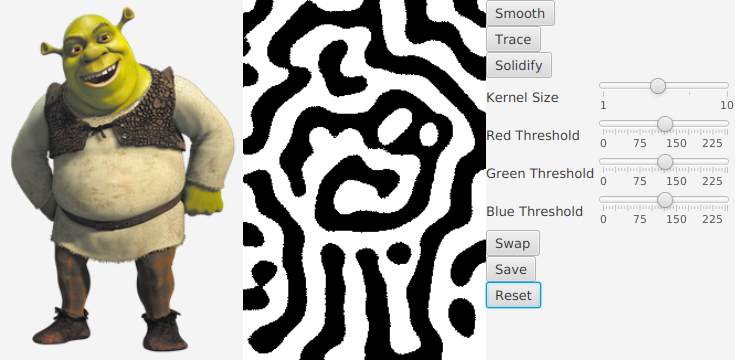
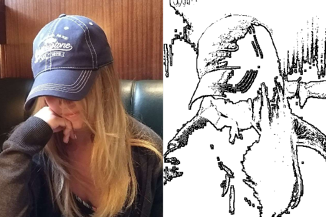
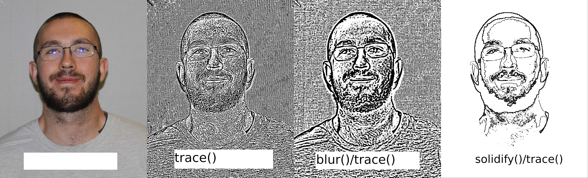
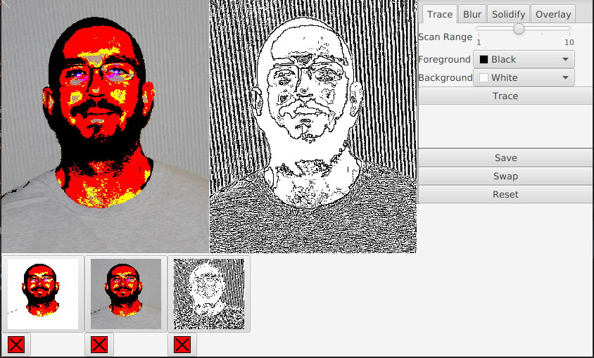

# TraceIO
Analyze images and trace over them.

# Developer Thoughts

## 07 November 2018

This project began as a barebones utility application that would trace outlines in images.

Turns out that's pretty difficult.

As I implement different features and filters and manipulations, TraceIO is beginning to grow. What was once a
command-line, one-and-done app, is now GUI'd software that allows for users to
see the changes as they're made. It also allowed for a much greater degree
of freedom, since users can easily specify parameters via the GUI, rather
than the command line.

But, at the end of the day, the GUI is just the GUI. TraceIO's focus is
on image processing.

I wanted to experiment with this, not just implement some pre-existing
algorithms and wash my hands of it.

So I started experimenting.

#### Trace

The first filter. Right now, as of Nov 07 and since its creation,
trace() works very simply. It evaluates each pixel in the image as 
the difference between those around it. It compares it to an arbitrary
value and if the difference is greater, it replaces that pixel with black.
If the difference is small, it replaces the pixel with white.

This single function was incredible and shitty. It was so simple,
and created some really freaky looking images, but it was terrible at
actually outlining things. It saw edges clear as day, but struggled
when dealing with noise.

After a few iterations, the entire image would
be this eldritch abomination of tentacles. You could see the
faintest semblance of the original image, but it was so slight
that it felt out of place.

And so I attempted to remove the noise.

#### Blur

One of the most effective ways of removing noise is through blurring.
I created a quick function blur() (although at the time it was called
smooth()). Each pixel became the average color of the pixels surrounding it.
It works quite well. Scratch that. It achieves its function. It is slow,
clunky, and doesn't remove noise as much as I'd like.

I attempted implementing a Gaussian Blur, but honestly that shit's
difficult and I decided to simply stick with my own blur until I got
sick of it (it's been like 2 days and I'm sick of it).

Unfortunately, just blurring the image and then tracing it wasn't enough.
In fact, it made things worse. After a couple iterations, the image becomes a nightmarish
shadow of the original.

After about a dozen iterations, it becomes abstract art, looks cool,
but loses any practicality.

I needed a different method of removing noise.

#### Solidify

The solidify() function looks at the image in kernels (small 5x5ish sections).
In each section, it uses RGB thresholds (set by the user) to
determine which colors appear in the majority of the kernel. It then "splots"
that color over the whole kernel.

In other words, solidify() pixelates the image and reduces it to the
main colors (black, white, red, green, blue, yellow, purple, cyan).

This fuckin worked amazingly. It provided reasonably similar images to the
input (provided good thresholds were found), made trace() so much more
effective.

#### Next up

Gotta fix that blur function, man

## 13 Nov 2018

Alright, brief hiatus because of actual work but I'm back to working on TraceIO.
I worked on an overlay() function that superimposes one image on top of the other.
Originally it was done just so I could see how some images lined up after processing.
However, it looks pretty neat. Below is the result of solidify() -> overlay() -> trace().

## 14 Nov 2018

Refactoring the GUI because it's turning into spaghetti code and I'm
gonna nip that in the bud.

## 15 Nov 2018

Took out the thumbnail bar because it looked ugly and was going to be a huge
pain to get to look good. Replaced it with a history GUI.
